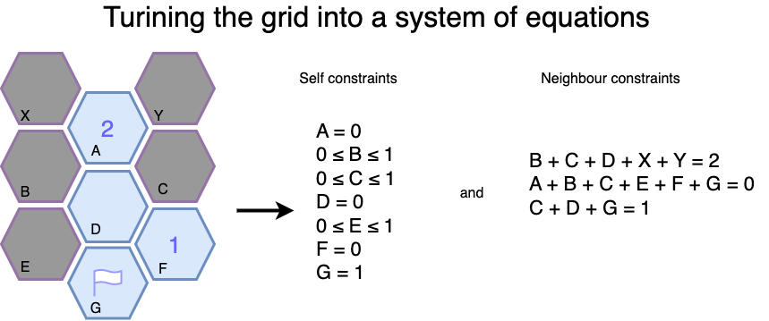

Looks at the screen for any hexagonal minesweeper boards
(https://html5.gamedistribution.com/82994c4d5faf459a98d155169c192092/) and then
detects all the possible cells that can be clicked or flagged as bombs.

# Detecting screen UI

To properly reveal cells, we need to first transform them into a structure that
can be more easily handled, like a simple array of coordinates and cell types.

A simple series of steps, mostly prebuilt by opencv can be used:
1) Turn the input image into monochrome (single channel) image
2) Erode the edges, so that individual cells are more easily distinguished
3) Turn the edges into polylines and filter only for polylines that resemble a hexagon
4) Take the centermost hexagon to be the middle of the universe (coordinates
0,0) and assign coordinates to all other hexagons.

# Revealing cells with scary math

You can construct a system of equations, where every cell is a number, either 1
(bomb) or 0 (empty). Whenever a cell on the screen is rendered as a number (say 2), that
puts another constraint in the system - that the sum of the variables around
this cell is 2.

There is one problem with this approach: z3 does not give us all possible
solutions and neither does it guarantee that any variable has a single solution.
This means that if z3 tells us that X=1 is a solution, it does not exclude X=0
being a solution as well!
To workaround that, for every variable I want to reveal, I ask z3 to solve the
system given that it is a bomb then a second time given it is empty. If it
finds a solution in both cases, there is not enough information to decide.
But if we have a solution in only one case, we can be sure what the cell is.

In the example above:
 - B and E must be 0  
 - C must be 1  
 - X and Y can be both 0 and 1, but after we reveal C we'll be able to know for sure.  
